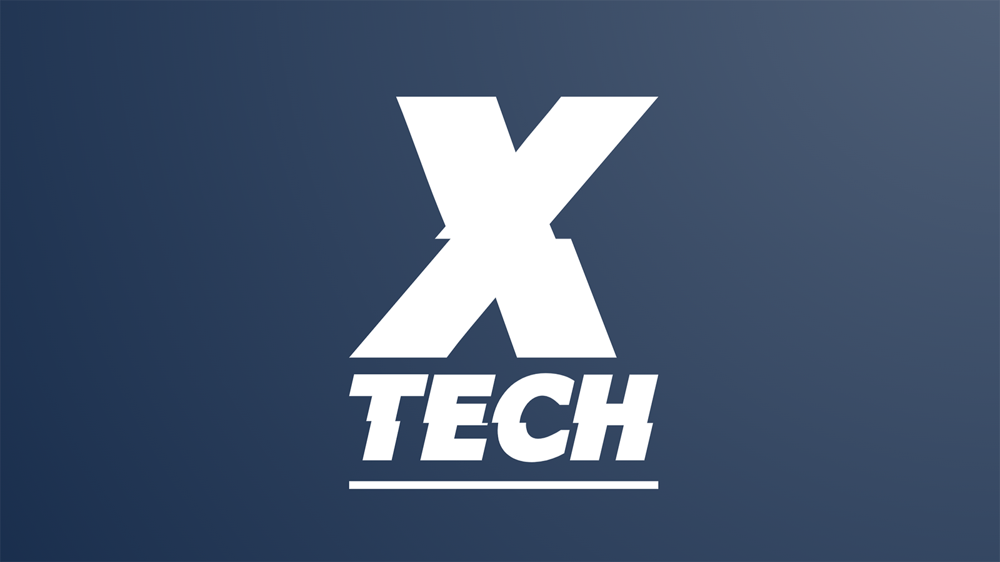

# X Tech

We choose **X Tech** as our company name. 

The reason behind this is that "X" is an appealing symbol with mystical significance, conveying the meaning of superpower. Although none of us from the company are genetic mutant superheroes as "X-men", we possess the ambition to use technology as our superpower, helping people improve and overcome obstacles they face, and making this world a slightly better one.

X can also represent experimental and extraordinary, fitting well with our company as a newborn technological startup in the athletic space. Our company will continue evolving from experimental to extraordinary, with the vision to help athletes stay extraordinary.

Table of Contents
---

- [People](./team/)
- [Team Principles](./team/team_principles.md)
- [Diversity](./team/diversity.md)
- [Product & Research](./product_research/)
    - [Market](./product_research/market.md)
    - [Roadmap](./product_research/roadmap.md)
