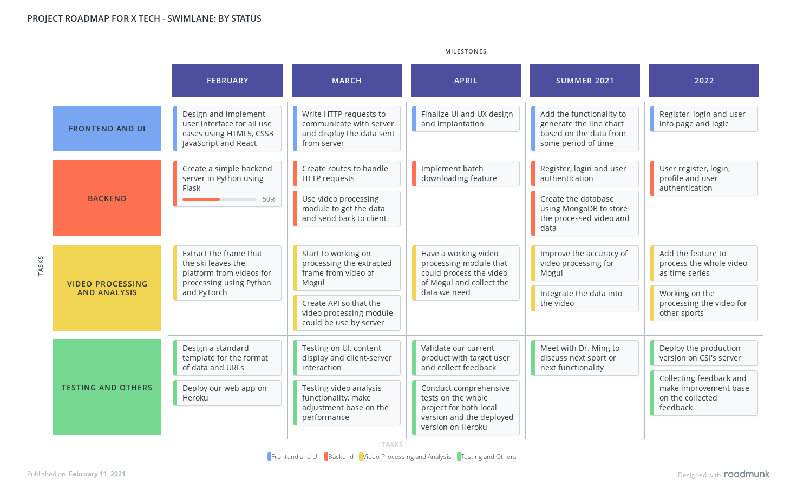

# Roadmap

## Short Term

- **Duration:** Feburary 2021
    - Design and implement user interface for all use cases using HTML5, CSS3 JavaScript and React
    - Create a simple backend server in Python using Flask
    - Extract the frame that the ski leaves the platform from videos for processing using Python and PyTorch
    - Design a standard template for the format of data and URLs
    - Deploy our web app on Heroku

- **Duration:** March 2021
    - Write HTTP requests to communicate with server and display the data sent from server
    - Create routes to handle HTTP requests
    - Use video processing module to get the data and send back to client
    - Start to working on processing the extracted frame from video of Mogul 
    - Create API so that the video processing module could be use by server
    - Testing on UI, content display and client-server interaction
    - Testing video analysis functionality, make adjustment base on the performance

- **Duration:** April 2021
    - Finalize UI and UX design and implantation
    - Implement batch downloading feature
    - Have a working video processing module that could process the video of Mogul and collect the data we need
    - Validate our current product with target user and collect feedback
    - Conduct comprehensive tests on the whole project for both local version and the deployed version on Heroku

## Medium Term

**Duration:** From May to September 2021
- Add the functionality to generate the line chart based on the data from some period of time
- Create the database using MongoDB to store the processed video and data
- Improve the accuracy of video processing for Mogul
- Integrate the data into the video
- Meet with Dr. Ming to discuss next sport or next functionality

## Long Term

**Duration:** By the the of 2021

- Register, login and user info page and logic
-User register, login, profile and user authentication
- Add the feature to process the whole video as time series 
- Working on the processing the video for other sports 
- Deploy the production version on CSI's server
- Collecting feedback and make improvement base on the collected feedback