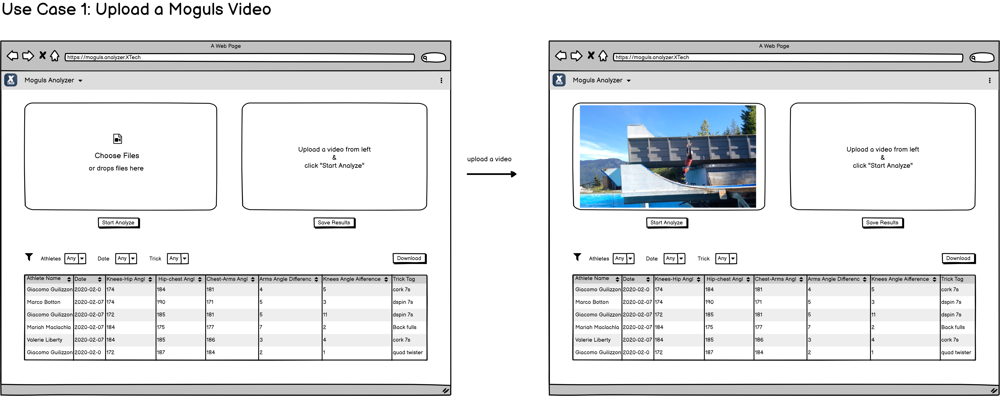
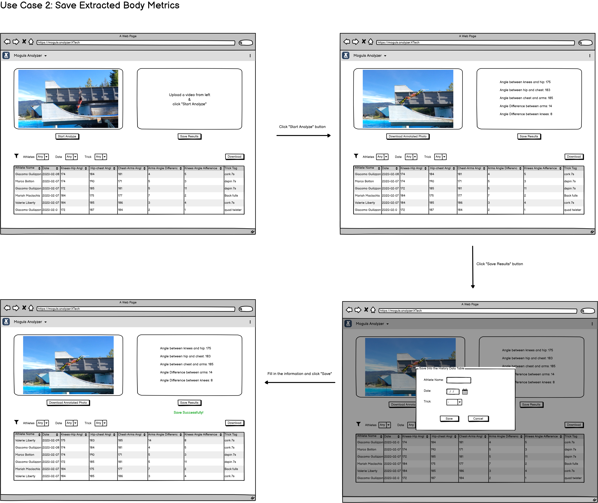
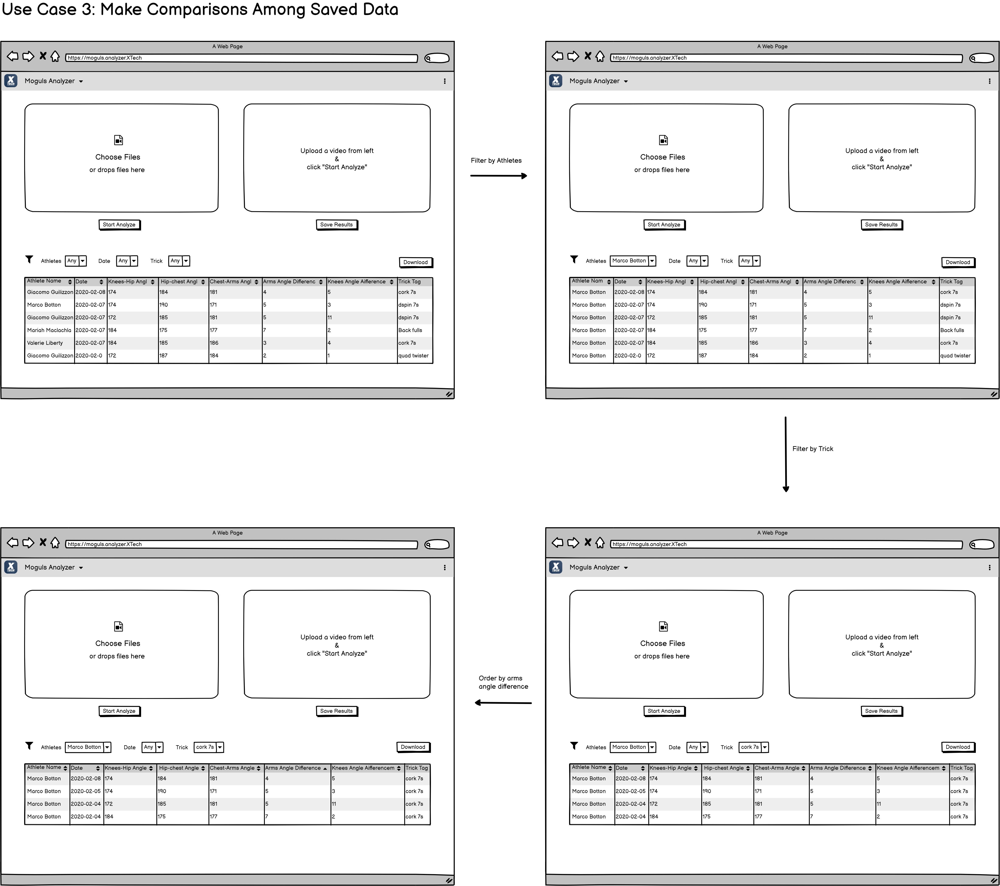
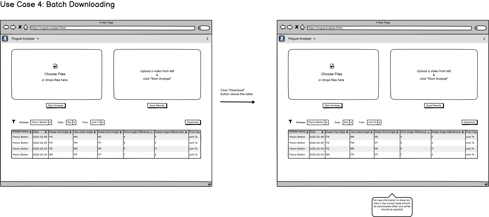

# Use Cases

There are 4 use cases for our web app. 

#### Use Case 1: Upload a Moguls Video

Users can click the `Choose File` button to upload a video clip of mogul to the server and the video will be stored in server and ready to be processed. 

#### Use Case 2: Save Extracted Body Metrics

After uploaded a video, user can click the `Start Analyze` button to signal the swever to process and analyze the video. The the result data will be sent back to client for display. Then, user can click the `Save Results` and there will be a popup window for user to fill in the information for the results. After all section in the popup windows is filled, user can then click the `Save` button to save the results in server. 

#### Use Case 3: Make Comparisons Among Saved Data

User should be able to access the data that is stored in server for comparisons purpose. Those data could be filtered by the name of athlete, date, trick and also displayed in ascending or descending order based on specific date column. 

#### Use Case 4: Batch Downloading

User should be able to upload multiple video files and use filter function to view the results. 