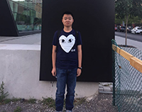

# Haoyu (Chen) Chen

- Software Developer
- Email: haoyu.chen@mail.utoronto.ca

## Links
- [GitHub](https://github.com/chenhaoyu426)
- [LinkedIn](https://www.linkedin.com/in/%E8%B1%AA%E5%AE%87-%E9%99%88-a24933198/)
- [Resume](https://learnsoftware.engineering/t/w2021/csc454/profile/159)

## About Haoyu

Haoyu is a fourth-year Computer Science and Statistics undergraduate at the University of Toronto. He studies computer science and has more interest in analyzing data and constructing models. 

He likes to play soccer and basketball. His favourite basketball player is Kobe Bryant and his favourite soccer player is Lionel Messi. In addition, he also enjoys playing Dota2 and Skylines.

## Strengths

- Good at web development
- Often put forward creative thoughts
- Care about many aspects’ details

## Weaknesses
- Sometimes cannot control emotions when there are high pressure and lots of due dates
- Often don’t want to ask for help when facing difficulties
- Feel awkward when doing presentations 

